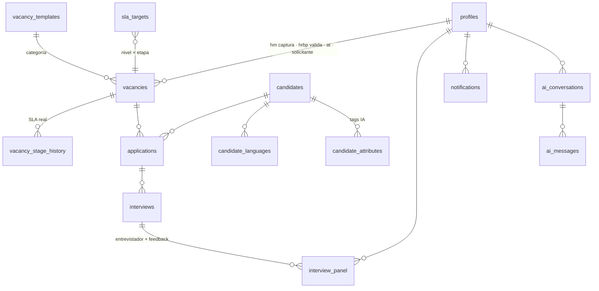

# Talento 360 — Flujo completo y modelo de datos

Documento de referencia para hacer la plataforma funcional. Todo lo de abajo está implementado en
[`supabase/migrations/20260923000000_initial_schema.sql`](supabase/migrations/20260923000000_initial_schema.sql)
(esquema + RLS + triggers + buckets). Las secciones 6 y 7 recogen lo que **no** cuadra hoy en el código
y las decisiones que necesito de ti.

---

## 1. Actores y permisos

| Rol (`app_role`) | Quién es | Ve | Puede hacer |
|---|---|---|---|
| `hrbp` | HR Business Partner (**BP**) | Vacantes donde es el BP asignado | **Solo valida lo que necesita el HM** (viabilidad y banda salarial): aprueba o devuelve con comentarios; asigna al reclutador (AT); pasa a Alineación; pasa a Oferta y **cierra como contratado**; administra plantillas. **No edita el contenido** de la requisición |
| `at` | Reclutamiento (Attraction) | Vacantes donde es AT + sus candidatos | Alta de candidatos y postulaciones, subir CV, agendar entrevistas (Calendar/Meet), armar panel, mover Búsqueda→Atracción→Selección, descartar en screening |
| `hm` | Hiring Manager / entrevistador | Vacantes donde es HM **o** está en un panel | **Crea y captura la requisición** (requisitos, no negociables, competencias, banda salarial, solicitante y su BP), da feedback, marca *finalista* / *descartar* (con justificación), mueve Selección→Oferta, usa el bot |
| `user` | Solicitante (seguimiento) | Solo la vacante que pidió: etapa, semáforo, próxima entrevista, historial | Nada (solo lectura). **No ve** compensación, feedback, resúmenes ni CVs |

> **BP = `hrbp`** (no hay un rol aparte). El HM dicta lo que necesita; el BP no lo redacta ni lo modifica: lo valida. Si el HM cambia algo ya validado, la validación se invalida y el BP recibe una notificación para revalidar.

Reglas transversales: el rol vive en `profiles.role` (lo asigna un admin con `service_role`; el usuario **no** puede
cambiarlo), nunca en `user_metadata`. Todo lo que no es de un rol se bloquea con RLS **y** con triggers.

---

## 2. Máquina de estados de la vacante

```mermaid
stateDiagram-v2
    [*] --> requisicion: HM captura lo que necesita
    requisicion --> alineacion: BP valida<br/>(requiere validación del BP + AT asignado)
    alineacion --> busqueda: AT/HM afinan la búsqueda
    busqueda --> atraccion: AT<br/>(≥1 candidato)
    atraccion --> seleccion: AT "Enviar pool al HM"<br/>(≥1 candidato vigente)
    seleccion --> oferta: HM/HRBP<br/>(≥1 finalista)
    oferta --> cerrada: BP (motivo obligatorio;<br/>contratado solo desde Oferta)
    seleccion --> busqueda: HM/AT si todos se descartan
    atraccion --> busqueda: AT
    oferta --> seleccion: HM/HRBP si rechazan la oferta
    requisicion --> cerrada: BP cancela
    alineacion --> cerrada: BP cancela
    busqueda --> cerrada: BP cancela
    atraccion --> cerrada: BP cancela
    seleccion --> cerrada: BP cancela
```

Las transiciones y quién puede ejecutarlas están en la tabla `stage_transitions` (datos, no código). Las **condiciones
de entrada** viven en el trigger `vacancy_guard`. Cualquier intento fuera de estas reglas falla en la base de datos,
sin importar de qué pantalla o API venga.

### SLA (días hábiles) — semáforo calculado, ya no manual

- Objetivo por `nivel` × `etapa` en `sla_targets` (valores por defecto **supuestos**, editables; ver §7).
- Días reales = `business_days_between(etapa_desde, now())` (lun–vie, sin `holidays`, zona CDMX).
- **verde** < 80 % del objetivo · **amarillo** ≥ 80 % · **rojo** > objetivo. Etapa `cerrada` → sin semáforo.
- Cada cambio de etapa cierra la fila anterior de `vacancy_stage_history` (con `dias_habiles_reales`) y abre la nueva.

### Estado del candidato (`applications.estatus`)

`screening → entrevista_agendada → en_proceso → finalista → contratado` · `descartado` (requiere justificación).

| Cambio | Quién | Automático |
|---|---|---|
| Se agenda una entrevista | AT | `screening → entrevista_agendada` |
| La entrevista pasa a `completada` | AT / cron | `entrevista_agendada → en_proceso` + notificación *feedback pendiente* |
| Entrevista cancelada / no_show (y no hay otra agendada) | AT | `entrevista_agendada → screening` |
| Finalista / descartar | **HM** (AT solo puede descartar) | Sella `decision_por`, `decision_at`; finalista notifica a HRBP y AT |
| Contratado | HRBP | — |

Solo se pueden agregar candidatos con la vacante entre **Búsqueda y Oferta**.

---

## 3. Flujo de punta a punta (con el dato que se toca en cada paso)

> **Estado de la interfaz:** los 15 pasos ya tienen pantalla o botón. Los cambios de etapa son botones en la tarjeta de cada vacante según el rol (el cierre pide motivo y persona contratada) y el alta de candidato (con CV y análisis de Gemini) está en la lista de candidatos, disponible cuando la vacante está entre Búsqueda y Oferta. Lo que falta ya no es de interfaz sino de **puesta en producción**: proyectos reales de Supabase y Google Cloud.

| # | Paso | Rol | Pantalla | Escritura / lectura |
|---|---|---|---|---|
| 1 | **Capturar la requisición** con lo que necesita: categoría → carga stack/cert/exp de la **plantilla**; título, área, nivel, requisitos y no negociables, competencias a evaluar, banda salarial, solicitante y BP que la validará | HM | `hm-nueva` *(hoy `hrbp-nueva`)* | `insert vacancies` (`hm_id` = yo, etapa `requisicion`); lee `vacancy_templates`, `competencies` → notifica al BP *(requisición por validar)* |
| 2 | **Validar lo que pide el HM**: aprueba (o devuelve con `bp_comentarios`), asigna al reclutador y avanza | BP | `hrbp-dashboard` → *Por validar* | `update vacancies set bp_validado_at=now(), bp_comentarios, at_id` → notifica al HM; luego `etapa='alineacion'` → notifica **AT y HM** y al solicitante |
| 3 | Si el BP devuelve la requisición, el HM ajusta; **cualquier cambio del HM a una requisición ya validada borra la validación** y avisa al BP | HM | `hm-nueva` (edición) | `update vacancies …` → trigger limpia `bp_validado_at/por` y notifica `requisitos_actualizados` |
| 4 | Iniciar búsqueda | AT o HM | `at-dashboard` | `etapa='busqueda'` |
| 5 | Alta de candidato + CV + idiomas | AT | `at-candidatos` | `insert candidates`, `candidate_languages`; sube a bucket `cvs/{candidate_id}/…`; `insert applications` (con `compat_pct`, `custom_fields`) |
| 6 | IA extrae atributos del CV | sistema | — | `service_role`: `candidate_attributes (fuente='cv')`, `candidates.cv_texto` |
| 7 | Filtrar y comparar | AT/HM | `at-candidatos`, `at-comparar` | lee `applications` + `candidates` + `candidate_languages` + `candidate_attributes`; columnas dinámicas desde `vacancy_templates.campos` |
| 8 | Pasar a Atracción y luego **Enviar pool al HM** | AT | `at-candidatos` | `etapa='atraccion'` → `etapa='seleccion'` → notifica al HM (*pool listo*) |
| 9 | Agendar entrevista (Calendar + Meet reales) | AT | `at-perfil` | API route crea evento → `insert interviews` (`calendar_event_id`, `meet_link`) + `interview_panel` |
| 10 | Se hace la entrevista; Gemini deja la nota en Drive | — | — | Cron: `service_role` actualiza `interviews.drive_doc_id/resumen_ia/resumen_puntos`, `estado='completada'`, sube nota a `interview-notes/{interview_id}/…`, extrae `candidate_attributes (fuente='entrevista')` |
| 11 | Feedback por entrevistador | HM / panel | `hm-entrevista` | `update interview_panel set veredicto, notas` (solo la propia fila, solo si `completada`) |
| 12 | Decisión | HM | `hm-entrevista` | `update applications set estatus='finalista'\|'descartado', decision_justificacion` |
| 13 | Consultar al bot | HM/AT | `hm-chat` | API route arma el contexto con `applications+interviews+attributes` de **la vacante**, llama a Gemini; guarda en `ai_conversations/ai_messages` |
| 14 | Pasar a Oferta | HM o BP | `hm-dashboard` | `etapa='oferta'` (exige finalista) → notifica a HRBP (*solicitar carta oferta*) |
| 15 | Cerrar | BP | `hrbp-dashboard` | `etapa='cerrada', cierre_motivo='contratado'` (+ `applications.estatus='contratado'`) |
| — | Seguimiento del solicitante | user | `user-dashboard`, `user-detalle` | lee `vacancy_overview`; `rpc('vacancy_tracking')` para próxima entrevista e historial |

### Fuente de datos por pantalla

| Pantalla | Reemplaza | Lee |
|---|---|---|
| Dashboards (HRBP/AT/HM/User) | `VACANTES_RAW` | vista `vacancy_overview` (etapa, semáforo, responsables, `candidatos_activos`) |
| Pendientes | `PENDIENTES` | `notifications` del usuario (`leida_at is null`) |
| Calendario | `CALENDAR_EVENTS` | `interviews` (por rol, vía RLS) + `vacancy_overview` para revisiones de SLA |
| `at-candidatos` / `at-comparar` / `at-perfil` | `CANDIDATOS_RAW` | `applications` ⨝ `candidates` ⨝ `candidate_languages` ⨝ `candidate_attributes` |
| `hm-nueva` (antes `hrbp-nueva`) | `CAMPOS_CATEGORIA`, `COMPETENCIAS` | `vacancy_templates`, `competencies` |
| `hrbp-dashboard` → *Por validar* | — | `vacancy_overview` con `pendiente_bp = true` |
| `hm-entrevista` | texto fijo de Mariana | `interviews` + `interview_panel` ⨝ `profiles` |
| `hm-chat` | `INITIAL_CHAT` | `ai_conversations` / `ai_messages` |
| `user-detalle` | `USER_EXTRA` | `vacancy_tracking(vacancy_id)` |

### Modelo (resumen)

Decisiones de modelado que conviene conocer:

- **`candidates` ≠ `applications`**: la persona (CV, datos) es una; su compatibilidad, estatus y `custom_fields` son *por vacante*.
- **`interviews.vacancy_id`** está denormalizado y garantizado por una FK compuesta `(application_id, vacancy_id)`, para que RLS sea barato y nunca pueda desalinearse.
- **Dos capas de información del candidato** (lo que pediste): `custom_fields` = estructurado por plantilla (filtrable por dropdown, índice GIN); `candidate_attributes` = vocabulario abierto detectado por IA (búsqueda por tag; base para sugerir campos faltantes al cerrar vacantes).
- **Notificaciones** (`notifications`) son la fuente de "Pendientes"; las crean triggers (cambio de etapa, entrevista agendada/completada, finalista). Los recordatorios por tiempo (feedback vencido, SLA en riesgo) requerirán `pg_cron` o el cron de Vercel: **pendiente**.
- **Storage**: `cvs` (privado, PDF/DOC/DOCX, 10 MB, `{candidate_id}/archivo`; solo AT escribe) e `interview-notes` (privado, solo `service_role` escribe).

---

## 4. Seguridad: lo que ya está garantizado en la base de datos

Probado contra un Postgres real con stubs de Supabase (`auth.uid()`, roles, `storage`): **0 fallos en 55 comprobaciones**, entre ellas:

- El solicitante ve su vacante y el conteo de candidatos, pero **cero** candidatos/postulaciones/CVs; `vacancy_tracking` no filtra feedback ni compensación.
- Un entrevistador de panel ve la vacante y sus candidatos; un usuario ajeno ve nada.
- Solo el HM crea requisiciones (el BP y el AT no); el HM no puede autovalidarse y el BP **no puede editar el contenido**, solo validar y asignar AT.
- Si el HM modifica una requisición ya validada, `bp_validado_at` se borra y el BP es notificado; sin revalidación no se pasa a Alineación.
- El BP de la vacante debe tener rol `hrbp`, el HM `hm`, el AT `at`, el solicitante `user` (trigger `vacancy_roles_check`).
- HM no puede tocar la compatibilidad de un candidato; AT no puede poner *finalista*; solo el BP cierra como *contratado* (y solo desde Oferta).
- No se puede pasar a Alineación sin validación del BP y AT asignado, a Selección sin candidatos ni a Oferta sin finalista.
- No se puede descartar sin justificación; el feedback solo se captura con la entrevista `completada` y solo en la fila propia.
- Vacante cerrada = inmutable. Ningún usuario puede cambiar su propio rol (GRANT por columna) ni insertar notificaciones.

Detalles de implementación relevantes (por si los replicas): helpers `SECURITY DEFINER` en el schema `private` (no expuesto); la
política `SELECT` de `vacancies` usa condición inline porque `INSERT … RETURNING` evalúa la política antes de que la fila
nueva sea visible para una función `STABLE`; los `GRANT` son explícitos porque las tablas nuevas ya no se exponen solas a la Data API.

---

## 5. Integraciones (aún no construidas; el esquema ya las soporta)

| Integración | Dónde escribe | Nota |
|---|---|---|
| Google login (Supabase Auth, proveedor Google) | `auth.users` → trigger crea `profiles` con rol `user` | Un admin asigna el rol. Restringir a `@liverpool.com.mx` con un Auth hook / `hd` |
| Calendar + Meet | `interviews.calendar_event_id`, `meet_link` | Server-side con el token del usuario (scopes `calendar.events`) |
| Notas de Gemini (Drive) | `interviews.drive_doc_id`, `resumen_ia`, `resumen_puntos`, `notas_path` | Cron de Vercel cada 2–5 min con `service_role`; asocia por `calendar_event_id` |
| Gemini (extracción y bot) | `candidate_attributes`, `ai_messages` | Solo desde el servidor; nunca `service_role` en el cliente |

---

## 6. Coherencia: lo que hoy no cuadra en el código

Revisé `data.ts`, `App.tsx` y las pantallas. Esto es lo que se contradice o no es derivable de datos reales, con la resolución que adopta el esquema.

| # | Hallazgo (dónde) | Resolución |
|---|---|---|
| 1 | **Fecha de la entrevista de Mariana:** 18 sep (`CALENDAR_EVENTS`, `USER_EXTRA`) vs **19 sep** (`HmEntrevista.tsx`, "completada · 19 sep") | Una sola fuente: `interviews.inicio`. Sugiero **18 sep, 3:00 pm** |
| 2 | **El chat dice "las 3 entrevistas"** (`INITIAL_CHAT`), pero v1 tiene 1 completada (Mariana) + 1 agendada (Emiliano); Daniela no tiene | El bot lee el contexto real; no habrá texto fijo |
| 3 | **Reclutadores como entrevistadores:** Sofía Martínez y Jorge Salinas son los AT de v1/v3 (`VACANTES_RAW.responsable`) pero en `HmEntrevista` son "Tech Lead" y "Product Lead", y `USER_EXTRA` los pone como entrevistadores de Emiliano. Jorge es AT de *Logística* y "Product Lead" de una vacante de TI | Personas distintas: AT = `vacancies.at_id`; entrevistadores = `interview_panel` (perfiles con `cargo`). Hay que renombrar en el seed |
| 4 | **v3 está en Oferta con semáforo rojo, pero sus candidatos son "Entrevista agendada" y "Descartado"**: no hay finalista | El trigger exige ≥1 finalista para entrar a Oferta. Seed: Rodrigo = finalista (entrevista ya completada) |
| 5 | **`candidatosCount` fijo** (v3 = 2 incluye a la descartada) y la etiqueta dice "en proceso" | `candidatos_activos` excluye descartados (v3 = 1) |
| 6 | **El semáforo (`sla`) es un hex escrito a mano** (`#F9A825`…), sin relación con la etapa ni los días | Calculado en `vacancy_overview.sla` (`verde/amarillo/rojo`); el color se decide en el front |
| 7 | **Evento del calendario "Screening – Ximena" el día 22**, antes de "hoy" (23 sep), y ella sigue en *Screening*; e5 "Entrevista de Rodrigo" el 24 con la vacante ya en Oferta | Al salir de `interviews` deja de haber eventos huérfanos; el seed los alinea (§8) |
| 8 | **"Próxima actualización: 28 sep"** fijo (`UserDetalle`, evento e6) | Derivable: `etapa_desde + dias_habiles_objetivo` (fecha límite de la etapa) |
| 9 | **`UserDashboard` muestra siempre `vacantes[0]` y `[1]`**, aunque cada vacante tiene distinto solicitante (Carlos, Renata, Pablo) | Filtra por `solicitante_id` vía RLS: cada quien ve solo lo suyo |
| 10 | **HM y HRBP no tienen dueño en los datos**: todos ven las 3 vacantes; `HmEntrevista` está fija en Mariana; el botón "Evaluar entrevista" del dashboard apunta siempre a ella | `hm_id` (captura) · `hrbp_id` (BP) · `at_id` en `vacancies`; `hm-entrevista` recibe `interview_id` |
| 11 | **Escolaridad como un solo string** ("UNAM — Ing. en Computación") y el filtro solo conoce UNAM/ITESO/Tec; los candidatos de IPN, Anáhuac e Iberoamericana **no se pueden filtrar** | `nivel_estudios`, `institucion`, `carrera` separados; opciones de filtro salen de los datos |
| 12 | **Compensación e idiomas como texto** ("$55,000 MXN", "Inglés avanzado") | `numeric` + `moneda`; `candidate_languages(idioma, nivel)` |
| 13 | **`HrbpNueva` no guarda casi nada** y ahora está en el rol equivocado: quien captura la requisición es el **HM**. Cert, experiencia, estudios y habilidades no están en estado; no hay título, área, nivel, BP ni solicitante; "Publicar" solo enciende un flag | Mover la pantalla al rol HM (`navTabsByRole`: `hm` gana "Nueva Requisición", `hrbp` pierde la suya). Ver cambios de UI abajo |
| 14 | `HrbpNueva` decide si un chip está activo con `bg.includes("7B")` — dejó de ser fiable tras el cambio de marca (#E10098); hoy funciona solo por el `|| color === "#fff"` | Pasar un booleano `selected` en vez de inferirlo del color (igual en `Dashboard`: `etapa.color === "#E10098"`) |
| 15 | **Dos nombres para lo mismo:** `area` "TI y Sistemas" vs `categoria` "TI-Sistemas" | `vacancy_templates` guarda ambos (`categoria` técnica, `area` de display) |
| 16 | `HmEntrevista` habla en femenino ("Marcada como Finalista", "Candidata descartada") y **descartar no pide motivo** | Texto neutro; el esquema exige `decision_justificacion` para descartar |
| 17 | El modal de agendar tiene **un solo** "Entrevistador" en texto libre, con valores por defecto (26 sep, 11:00, sofia.martinez@…) | Selector múltiple de perfiles → `interview_panel` |

### Cambios de UI que exige el esquema (mínimos)

> **Ya implementado en la app (con datos de demostración en memoria):** requisición del HM (`HmNueva`), bandeja *Por validar* del BP con aprobar / devolver con comentarios y asignación de AT (`HrbpValidar`), insignias de estado de validación en el inicio, revalidación cuando el HM cambia algo ya validado, y pendientes dinámicos por rol. Falta conectarlo a Supabase.

1. **Nueva requisición (rol HM):** título, área (de la plantilla), nivel (`bajo/medio/alto/complejo`), banda salarial, selectores de **BP y solicitante**; estudios mínimos como enum; guardar todos los campos. El AT **no** se elige aquí: lo asigna el BP al validar.
2. **Bandeja "Por validar" (rol HRBP):** lista de requisiciones con `pendiente_bp`, con botones **Aprobar** (y elegir AT) y **Devolver con comentarios**; el HM ve los comentarios y el aviso de revalidación.
3. **Botón "Enviar pool al HM"** (Atracción → Selección) y **"Solicitar oferta"** / **"Cerrar vacante"** con motivo.
4. **Alta de candidato** con carga de CV.
5. **Justificación obligatoria** al descartar.
6. Manejo de errores: los triggers devuelven mensajes en español listos para mostrar (`error.message`).

---

## 7. Decisiones que necesito de ti

1. **¿El Hiring Manager y el solicitante son la misma persona?** Mi supuesto: **no** (HM decide; el solicitante solo da seguimiento). Si son el mismo, se elimina el rol `user` o se le da acceso de HM.
2. **Metas de SLA:** puse valores razonables por nivel y etapa (p. ej. nivel medio: 2 / 2 / 10 / 5 / 8 / 5 días hábiles; total 32 vs. 52 reales en México). Confirma o pásame los de la lámina 5.
3. **Login:** para la demo propongo **Google real + 4–5 usuarios demo** (correo/contraseña) y que el selector de rol de la pantalla inicial **inicie sesión con el usuario demo de ese rol**. Así se conserva el "cambiar de rol" para los jueces sin saltarse RLS.
4. **Cálculo de `compat_pct`:** hoy es un número fijo. ¿Lo trae Assessfirst, lo calcula Gemini contra los no negociables, o lo capturamos a mano para la demo? El esquema guarda `compat_fuente` y `compat_detalle` para cualquiera de las tres.
5. **Privacidad:** el solicitante ve el **nombre** del candidato en su historial (como en el mock). Si prefieres anonimizarlo, se cambia en `private.vacancy_tracking`.

---

## 8. Seed de demo propuesto (coherente con todo lo anterior)

Hoy = **23 sep 2026**. Los nombres marcados con * son nuevos (el mock no tenía HRBP ni HM ni entrevistadores distintos).

| Vacante | Etapa · SLA | AT | HM* | Candidatos |
|---|---|---|---|---|
| **v1** Backend Developer Sr — Pagos (medio) | Selección · **amarillo** (`etapa_desde` 14 sep → 7/8 días) | Sofía Martínez | Luis Herrera* | **Mariana** 94 % `en_proceso` — entrevista técnica **18 sep 3:00 pm** completada, panel Diego Ramírez* (Tech Lead) y Karla Ibarra* (Product Lead), ambos *Recomendado* · **Emiliano** 81 % `entrevista_agendada` — **26 sep 11:00 am** · **Daniela** 68 % `screening` |
| **v2** Marketing Digital (medio) | Atracción · **verde** (`etapa_desde` 22 sep) | Andrea López | Valeria Campos* | **Ximena** 76 % — screening reagendado al **24 sep 9:30 am** → `entrevista_agendada` |
| **v3** Coordinador de Logística (medio) | Oferta · **rojo** (`etapa_desde` 8 sep → >5 días) | Jorge Salinas | Ricardo Mena* | **Rodrigo** 72 % **finalista** (entrevista completada 11 sep) · **Paulina** 65 % `descartado` con justificación |

BP/HRBP* (p. ej. Patricia Vega) valida las tres requisiciones que capturaron sus HM; solicitantes Carlos Núñez, Renata Cifuentes y Pablo Estrada. Con esto, cada dato de
las pantallas (calendario, pendientes, chat, seguimiento) sale de las mismas filas y ya no puede contradecirse.

---

## 9. Siguientes pasos

> Guía paso a paso para el punto 1–2: [`SUPABASE_SETUP.md`](SUPABASE_SETUP.md). Ya están escritos `supabase/seed.sql`, `supabase/demo_data.sql` (probado: 4 vacantes y 6 candidatos coherentes) y `scripts/create-demo-users.mjs`.

1. **Aplicar la migración** en un proyecto Supabase (no tengo el CLI instalado ni el MCP de Supabase autenticado): `supabase init` → `supabase link --project-ref <ref>` → `supabase db push`; o pegar el `.sql` en el SQL Editor. Habilitar el proveedor Google en Auth.
2. **Seed** (catálogos: plantillas por categoría, competencias, festivos; y el dataset de §8).
3. `supabase gen types typescript` → tipos para el front; `@supabase/ssr` + variables de entorno (`NEXT_PUBLIC_SUPABASE_URL`, clave publicable; la `service_role` solo en el servidor).
4. Conectar pantallas en este orden: auth/roles → dashboards (`vacancy_overview`) → requisición → candidatos/comparativa → entrevistas → decisión → notificaciones.
5. Después: Calendar/Meet, cron de Drive/Gemini, bot.

## Anexo (demo): evaluación previa, comentarios y vista masiva
Solo en modo demo (datos en memoria, `src/lib/demo/postulaciones.ts`); el esquema de Supabase aún no tiene tablas para esto.
- **Evaluación previa (assessment):** la envía el **AT** (tipo, plazo en días hábiles, mensaje) a una o varias postulaciones; la persona candidata la entrega desde su portal y el AT la califica de 0 a 100. Estados: enviada · entregada · calificada · vencida.
- **Comentarios:** hilo interno por postulación; escriben AT, HM y BP (la persona candidata no lo ve).
- **Vista masiva:** pantalla *Postulaciones* para AT, HM y BP: filtros, orden, selección múltiple, envío de evaluaciones y comentarios en bloque, exportar CSV.
- Para llevarlo a la base: tablas `assessments` (application_id, tipo, estado, enviada_at, vence_at, score, enviada_por) y `application_comments` (application_id, autor_id, texto, created_at) con RLS por rol, y un trigger que notifique al entregar.
